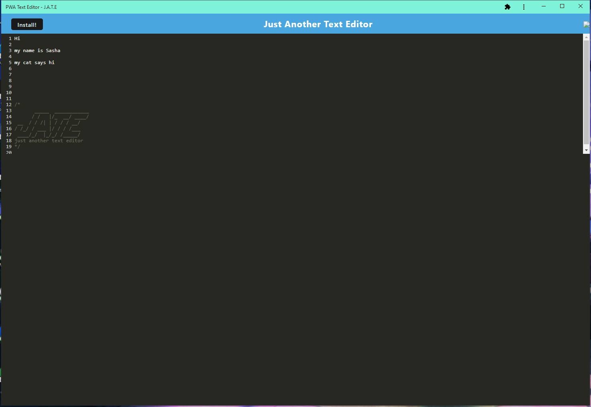

# PWA Text Editor

## Table of Contents
- [Description](#description)
- [Installation](#installation)
- [Usage](#usage)
- [Contributing](#contributing)
- [License](#license)
- [Questions](#questions)

## Description:

 This is a text editor that stores notes and code snippets both online and offline.

## Installation:
 Click the install button at the top left corner to download JATE

## Usage:
 Just type in whatever you want and press the save button

## Contributing:
 n/a

## License:
 [MIT](https://opensource.org/licenses/MIT)

## Questions:
 - Visit my github at: [sdoval27](https://github.com/sdoval27)
 - View the repository at: [JATE](https://github.com/sdoval27/pwa-text-editor)
